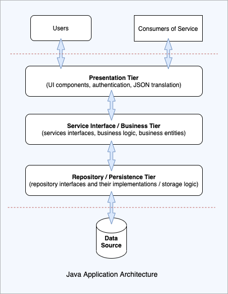

## Introduction
Java applications almost always handle sets of data and that data must be maintained in such a 
manner that that data can be easily accessed, manipulated, and updated. This data is persisted so
that it can be accessed even if the application itself is not up and running: this means that the
storage of data is maintained in a way that keeps it separate or decoupled from the rest of the
application. In most cases data is organized in the form of a database. If the form of storage
allows data to be queried and updated then that form represents a database.

Application architects split application functionality into tiers. Think of the database as the base
tier where the data is stored. The repository tier also known as the data access tier forms the
interface tying together the base tier and the rest of the application. The service tier is built
on the repository tier or level. The service level both prepares data entered into the system by the
user so that it can be properly stored and it transforms and prepares data brought to it from
storage by the repository so that it can be presented in the user interface.

The top tier, known as the presentation level or interface level, receives commands and prepared
data. This presentation level either sends those commands and data to the service level for
modifications and processing or prepares those commands and data in order to display results to the 
user.

The purpose of this article to is to focus on the repository tier especially with an eye to using
the ability of spring boot jpa data to infer findBy or, what is the same thing, getBy methods.

## What is the Repository Interface?
The repository interface is a Java interface that describes a Data Access Object (DAO) with its 
expected behavior, based on which Spring Data will automatically generate the needed DAO logic 
behind the scenes: compare this with the Android Room data access logic which requires 
the programmer to explicitly create DAO interfaces that correspond to the entity classes. The 
repository interface requires a class marked with @Entity, and a field marked with @Id as inputs.

A Custom Repository interface needs to extend one of following interfaces: 

* Repository–basic marker repository
* CrudRepository – adds generic methods for CRUD operations
* PagingAndSortingRepository–adds findAll methods for paging/sorting
* JpaRepository– JPA specific extension of Repository

## The Repository Interface Defined
Define a repository interface by doing the following:
* Create a Java Interface that extends one of the following:
    * Repository
    * CrudRepository
    * PagingAndSortingRepository
    * JpaRepository
* Create a class with an @Entity annotation
* Inside the @Entity class, create a simple primary key annotated with @Id annotation or create a
class that will represent a complex key annotated with @EmbeddedId annotation at the field level and 
with the @Embeddable annotation at the key class definition level
* @EnableJpaRepositories points to packages which should be scanned for repositories. The 
@EnableJpaRepositories does not have to be included manually because the spring boot 
@SpringBootApplication found in the application class includes the annotation 
@EnableAutoConfiguration which in turns includes @EnableJpsRepositories when 
spring-boot-starter-data-jpa has been include as a class path dependency in the pom file.
* The repository interface is an interface, not a class in order for Spring Data to be able to use 
what is called a JDK Dynamic Proxy to intercept all calls to the repository and also to allow the
creation of custom based repositories for every Dao based on a SimpleJpaRepository configured at 
@EnableJpaRepositories level. 

## The Naming Convention for the finder method in the Repository Interface

* The template form is: find[limit]By[property/properties expression][comparison][ordering operator]
* [limit] – the result of the query can be limited by the usage of the `first` or `top` keyword:
  * find`First3`ByFirstname
  * find`First`ByOrderByLastnameAsc
  * find`Top6`ByLastname
  * find`Top`ByOrderByDateDesc
* [property/properties expression] – the result will be filtered based on the property of the entity: 
multiple properties can be used by using the `And` or the `Or` keyword:
  * findBy`LastnameAndFirstname`
  * findBy`LastnameOrFirstname`
  * findBy`Firstname`
* [comparison] – the comparison mode can be specified after specifying the property used for 
filtering:
  * findByFirstname`Is`
  * findByFirstname`Equals`
  * findByStartDate`Between`
  * findByAge`LessThan` 
  * findByAge`LessThanEqual`
  * findByAge`GreaterThan `
  * findByAge`GreaterThanEqual`
  * findByStartDate`Before`
  * findByStartDate`After`
  * findByAge`IsNull` 
  * findByAge`IsNotNull`
  * findByFirstname`Like`
  * findByFirstname`NotLike`
  * findByFirstname`StartingWith`
  * findByFirstname`EndingWith`
  * findByFirstname`Containing`
  * findByLastname`Not`
  * findByAge`In`(Collection<Age> ages)
  * findByAge`NotIn`(Collection<Age> ages)
  * findByActive`True` 
  * findByActive`False`
  * findByFirstname`IgnoreCase`
  
* [ordering operator] – optionally you can specify ordering operator at the end of the method name 
  * findByLastnameOrderByFirstname`Asc`
  * findByLastnameOrderByFirstname`Desc`